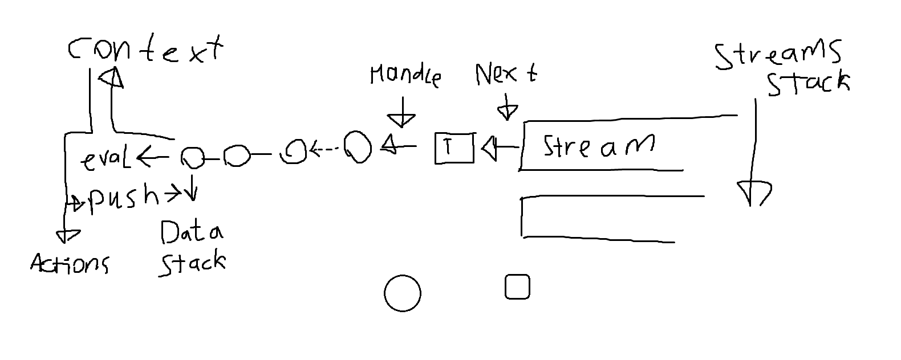

# meta-asm

## Motivation
Half year ago I was playing game [Virtual Circuit Board](https://store.steampowered.com/app/1885690/Virtual_Circuit_Board/). Main goal of game - create your own processor and assebler for it. I successfully made my own [brainfuck](https://en.wikipedia.org/wiki/Brainfuck)-processor and assembler laguage for it.

I especially liked the idea of being able to define a custom assembly language right in the program text. So I wanted to do the same but with real assembler: create a program/compiler that can output working executable files

## Early experiments

I started by taking a concept from a game.
There is a parser that parses text and directly converts it into a byte array. In the program text you can:
- Set byte values directly
- Specify the characters that are translated into bytes.

I tried to do the same - you can declare a character that denotes a group of bytes. You can combine them through bitwise operations.

Very quickly I ran into the fact that bitwise operations are not enough in practice. In real assemblers, the size of commands can be very different from command to command, and it also depends on the arguments.

So a character representing a register, for example, has to change the structure of the instruction that was written before it.

I tried to solve this by making up random language constructs. But as a result, the syntactic constructions became extremely inconsistent.

In the end, I came to the idea that in order to be able to extend the syntax with arbitrary constructs, I needed a foundation in the form of a full-fledged language. I chose Forth as such a language.

## Atomic Forth
There isn't much to say here. I just opened dozens of lessons and articles on writing a Forth and experimented with implementations for a week.

As a result, I got a Forth with the following features:
- I took symbols, not numbers, as a basis. That is, there are objects on the stack that can have a different type, and this type can be checked.
- Ability to change the parser logic by redefining the "next" operation that takes a character from the input stream.
- Immediately built-in system for including other files in the code

  
Atoms pipeline looks like this

  Sorry for paint :D
  May be later I will fix it
  

## What's left to do

Now it remains to build in Forth work with a byte buffer, which I implemented in the course of experiments. After that, it will be possible to try to implement some specific assembler syntaxes.